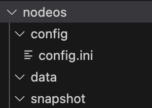
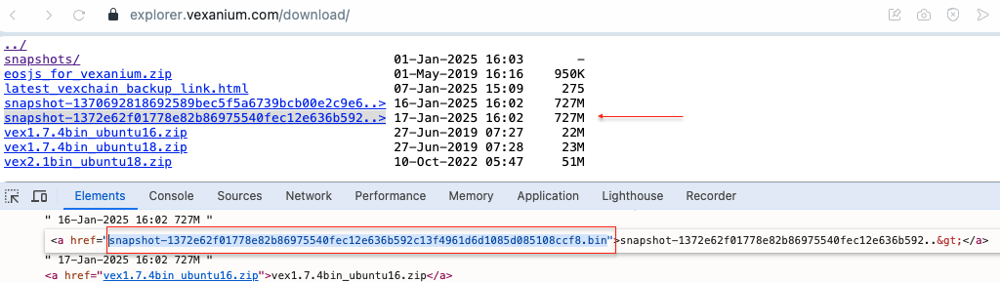

# How to Deploy a Vexanium BP Node

[](https://github.com/vexanium/VexChain)
[](https://explorer.vexanium.com/download/snapshots/)


First, install [VexChain](https://github.com/vexanium/VexChain) based on your operating system.

Create the `config`, `data` and `snapshot` folders as shown in the image:

[](img/img-1.png)

Open the `config.ini` file and copy the script below:
```
############################################
# Block Production Configuration
############################################

# Enable block production (required for producers)
enable-stale-production = true
producer-name = accountbp

# Signature provider for block production
signature-provider = VEX7=KEY:5Jg7

############################################
# HTTP Server Configuration
############################################

# HTTP server settings
http-server-address = 0.0.0.0:8888
http-validate-host = false
verbose-http-errors = true

# CORS configuration
access-control-allow-origin = *
access-control-allow-headers = *

# HTTP performance settings
http-max-response-time-ms = 100

############################################
# P2P Network Configuration
############################################

# List of peer addresses for syncing
p2p-peer-address = 103.129.220.149:8092
p2p-peer-address = mainnet.databisnis.id:8091

############################################
# Plugin Configuration
############################################

# Core EOSIO plugins
plugin = eosio::chain_plugin
plugin = eosio::http_plugin
plugin = eosio::net_plugin
plugin = eosio::producer_plugin
plugin = eosio::history_plugin
plugin = eosio::history_api_plugin

############################################
# Chain and Database Configuration
############################################

# Resource limits
max-transaction-time = 3000

# Chain state database size (1TB for full history node)
chain-state-db-size-mb = 1048576

# Reversible blocks database size (10GB)
reversible-blocks-db-size-mb = 10240

############################################
# Development Options
############################################

# Enable contract debugging (logs actions)
contracts-console = true
```

### Configuration 
- Replace `producer-name` with your BP account name
- Replace `signature-provider=VEX7=KEY:5Jg7` to `VEX7` public key and private key `5Jg7` from bp account
- Adjust `chain-state-db-size-mb` and `reversible-blocks-db-size-mb` according to your PC or server specifications.

Open the `nodeos/snapshot` folder, and check the list of the latest snapshots at
[List Snapshots](https://explorer.vexanium.com/download/) 
[](img/img-2.png)

Download the latest snapshot by running:

```sh
wget https://explorer.vexanium.com/download/snapshot-1372e62f01778e82b86975540fec12e636b592c13f4961d6d1085d085108ccf8.bin --no-check-certificate

```
Next, create a `nodeos.sh` file inside the `nodeos` folder you created, and copy the following script:
```sh
nodeos -e -p accountbp \
  --snapshot /root/nodeos/snapshot/snapshot.bin \
  --config-dir /root/nodeos/config \
  --data-dir /root/nodeos/data \
  --disable-replay-opts
```

### Configuration

- Replace accountbp with your BP account name.
- Update the paths for `--snapshot`, `--config-dir`, and `--data-dir` to match your folder locations. You can find the exact paths by running`pwd`.

 
Once you've completed the above steps, you can start the node with:
```sh
./nodeos.sh
```